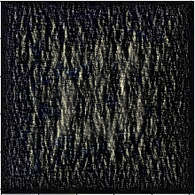
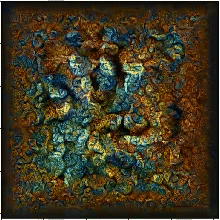
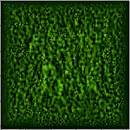
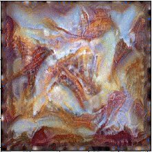
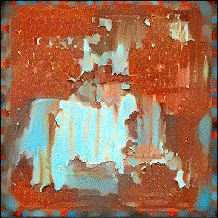

## Projet DELIRES 
## Multi-scale neural texture synthesis
This repo is a modification to Snelgrove's code for our project
The main modification is the addition of a multiscale spectral loss.

The following text 
By using a Gaussian pyramid and extracting Gatys-style "style" descriptors
using the Gramian of intermediate VGG layers for each spatial scale in the
pyramid, we can create much higher-resolution images, with structure at
multiple image scales, not necessarily aligned with the receptive field of the
layers of Gatys.

More information at [the research page](http://wxs.ca/research/multiscale-neural-synthesis/).
## Quickstart

Install the pre-requisites

    pip3 install -r requirements.txt

open a remote kernel with spyder, and run synthesize.py after modifying the desired parameters

## The evolution of the texture imgs through iterations
<table>
    <tr>
        <td>
        </img>
        </td>
        <td>
        </img>
        </td>
        <td>
        </img>
        </td>
        <td>
        </img>
        </td>
    </tr>
</table>

## The videos synthesized with interframe loss
<table> 
    <tr>
        <td> </img>   </td>
        <td> </img>   </td>
    </tr>
</table> 
